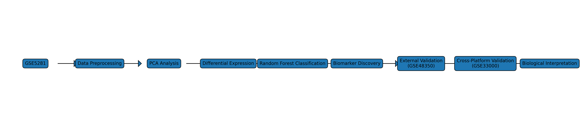
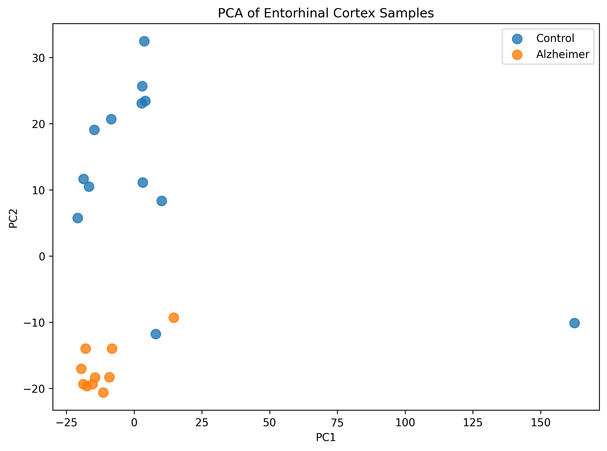
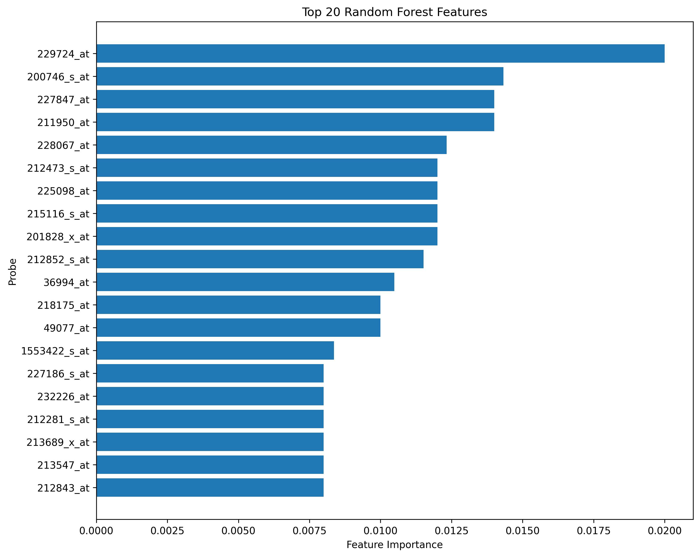
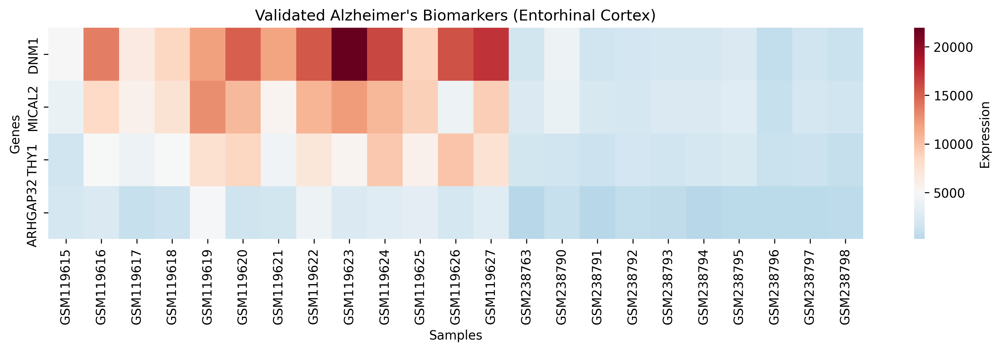
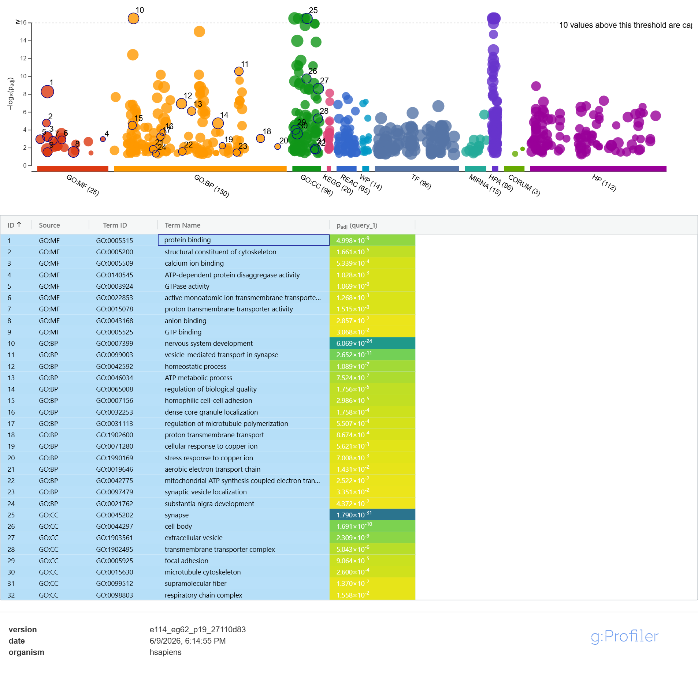
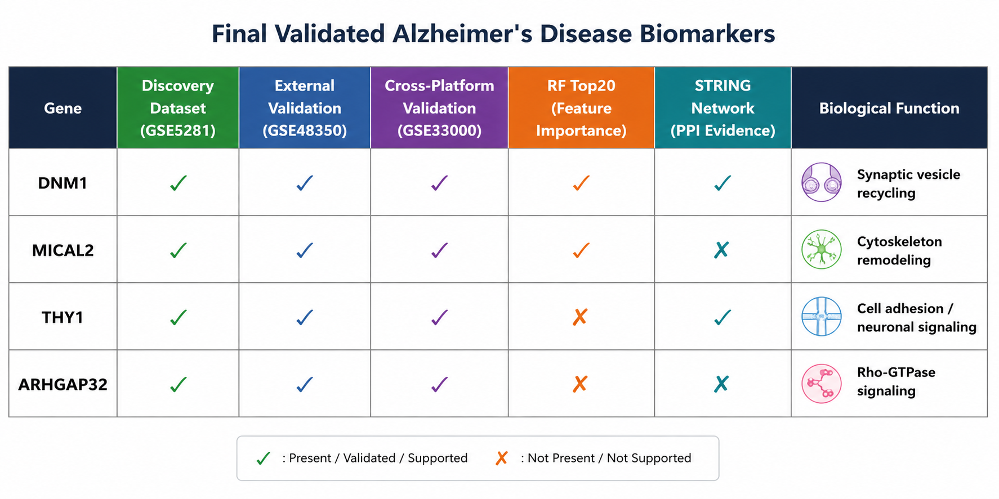

# AI-Driven Alzheimer's Disease Biomarker Discovery and Multi-Dataset Validation

## Overview

Alzheimer's disease (AD) is the most common neurodegenerative disorder and remains a major global health challenge. Early diagnosis is difficult due to the complex molecular mechanisms underlying disease progression.

This project combines transcriptomic analysis, machine learning, functional enrichment, and network biology to identify and validate robust Alzheimer's disease biomarkers from independent public datasets.

Using differential gene expression analysis, Random Forest classification, cross-platform validation, Gene Ontology enrichment, and protein-protein interaction network analysis, four candidate biomarkers were identified and validated across multiple cohorts:

- DNM1
- MICAL2
- THY1
- ARHGAP32

---

## Project Objectives

- Identify genes differentially expressed in Alzheimer's disease brain tissue.
- Train a machine learning model capable of distinguishing Alzheimer's samples from controls.
- Discover biologically relevant biomarkers using feature importance analysis.
- Validate candidate biomarkers across independent datasets.
- Investigate biological functions and interaction networks associated with identified genes.

---

## Datasets

### Discovery Dataset

| Dataset | Description |
|----------|------------|
| GSE5281 | Alzheimer's Disease vs Control brain samples |

### External Validation Dataset

| Dataset | Description |
|----------|------------|
| GSE48350 | Independent Alzheimer's cohort |

### Cross-Platform Validation Dataset

| Dataset | Description |
|----------|------------|
| GSE33000 | Alternative microarray platform validation |

Data Source:

https://www.ncbi.nlm.nih.gov/geo/

---

## Methodology

### 1. Data Preprocessing

- Downloaded GEO expression matrices
- Probe-level expression extraction
- Metadata processing
- Alzheimer's vs Control sample selection
- Missing value handling
- Expression matrix normalization verification

### 2. Differential Expression Analysis

Performed statistical testing to identify genes significantly altered in Alzheimer's disease.

Methods:

- Welch's t-test
- Fold-change estimation
- Multiple testing correction (FDR)

Outputs:

- Significant genes
- Volcano plot

---

### 3. Machine Learning Classification

Model:

Random Forest Classifier

Purpose:

Classify Alzheimer's and control samples using transcriptomic profiles.

Performance:

| Metric | Score |
|----------|----------|
| AUC | 0.912 |
| Precision | 0.90 |
| Recall | 0.90 |
| F1 Score | 0.90 |
| Accuracy | 91.3% |

---

### 4. Feature Importance Analysis

Random Forest feature importance scores were used to identify highly predictive genes.

Top predictive genes included:

- GABRB3
- GNB1
- DNM1
- MICAL2
- NCAM1
- ABI2

---

### 5. Biomarker Selection

Candidate biomarkers were selected based on:

- Differential expression significance
- Machine learning importance
- Biological relevance
- Validation consistency

Final candidate biomarkers:

| Gene | Biological Function |
|--------|------------------|
| DNM1 | Synaptic vesicle recycling |
| MICAL2 | Cytoskeletal remodeling |
| THY1 | Cell adhesion and neuronal signaling |
| ARHGAP32 | Rho-GTPase signaling |

---

### 6. External Validation

Validation performed using:

- GSE48350
- GSE33000

All four biomarkers demonstrated consistent dysregulation across independent datasets.

---

### 7. Functional Enrichment Analysis

Platform:

g:Profiler

Significantly enriched biological processes included:

- Nervous system development
- Vesicle-mediated transport in synapse
- Synaptic vesicle localization
- Regulation of microtubule polymerization
- ATP metabolic process

Significantly enriched cellular components included:

- Synapse
- Extracellular vesicle
- Microtubule cytoskeleton
- Respiratory chain complex

These results strongly support neuronal and synaptic dysfunction as central mechanisms associated with Alzheimer's disease.

---

### 8. Protein-Protein Interaction Network Analysis

Platform:

STRING Database

Network analysis revealed biologically meaningful interactions connecting:

DNM1 → GABRB3 → NCAM1 → THY1

This interaction chain highlights:

- Synaptic signaling
- Neurotransmission
- Neuronal connectivity

MICAL2 and ARHGAP32 likely participate in parallel pathways involving cytoskeletal remodeling and intracellular signaling.

---

## Key Results

### Final Validated Biomarkers

| Gene | Discovery | Validation | Cross-Platform | RF Top20 | STRING Network |
|--------|-----------|------------|---------------|-----------|---------------|
| DNM1 | ✓ | ✓ | ✓ | ✓ | ✓ |
| MICAL2 | ✓ | ✓ | ✓ | ✓ | ✗ |
| THY1 | ✓ | ✓ | ✓ | ✗ | ✓ |
| ARHGAP32 | ✓ | ✓ | ✓ | ✗ | ✗ |

---

## Figures

### Workflow


### Volcano Plot


### PCA Analysis


### Feature Importance


### Confusion Matrix


### Biomarker Validation Heatmap


### Functional Enrichment


### STRING Protein Network


### Biomarker Summary


---

## Repository Structure

```text
AI-Alzheimers-Biomarker-Discovery
│
├── data/
├── notebooks/
├── scripts/
├── figures/
├── results/
├── report/
├── README.md
└── requirements.txt
```

---

## Limitations

- Microarray-based datasets only
- Computational validation without wet-lab experiments
- Limited sample diversity
- Additional RNA-seq and proteomic validation would strengthen findings

---

## Future Directions

- Multi-omics integration
- Deep learning-based biomarker discovery
- Drug repurposing analysis
- Network pharmacology studies
- Experimental validation in cellular and animal models

---

## Conclusion

This study integrates bioinformatics, machine learning, functional enrichment, and network biology to identify robust Alzheimer's disease biomarkers. Four candidate biomarkers (DNM1, MICAL2, THY1, and ARHGAP32) were consistently validated across independent cohorts and platforms, suggesting potential utility for future Alzheimer's disease research and biomarker development.

---

## Author

Sanskar Badgujar

Independent Bioinformatics & AI Research Project
2026